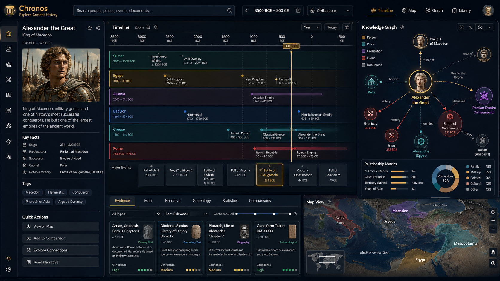

# Chronos

Chronos is a platform for exploring thousands of years of world history as a navigable knowledge graph — civilizations, empires, kingdoms, people, events, places, religions, documents, and the relationships (causal, temporal, geographic) between them. The long-term vision is something like **"Google Maps + Wikipedia + a Knowledge Graph of History."**

This is a monorepo with two independent projects:

| Project | Status | What it is |
|---|---|---|
| [`ingestion/`](ingestion/README.md) | ✅ implemented | Python pipeline that uses a local LLM (or OpenAI) via LangGraph to generate, validate, deduplicate, and persist historical knowledge into Postgres + pgvector. |
| [`frontend/`](frontend/README.md) | 🚧 planned, not implemented | Firebase app to browse/visualize the knowledge graph. |

## Vision / goal

The mockup below is the target experience for the (not yet built) `frontend/`: a timeline of civilizations, a knowledge-graph panel for the selected entity (person/place/event/document relationships), a map view, and a primary-source evidence panel with confidence scores — all browsing the same graph the `ingestion/` pipeline populates.



*This is a design mockup of where the product is headed, not a screenshot of working software — `frontend/` hasn't been built yet.*

## Data ingested so far

Snapshot of the local Postgres instance as of 2026-08-22 (see [`ingestion/`](ingestion/README.md) for how to reproduce/extend this):

| Table | Rows |
|---|---|
| `entities` | 194 |
| `events` | 17 |
| `relationships` | 115 |
| `claims` | 442 |
| `chunks` | 465 |
| `ingestion_runs` | 4 |

**Civilizations fully ingested** (4 of 42 seeded in [`ingestion/data/civilizations.yaml`](ingestion/data/civilizations.yaml)):

| Civilization | Entities created | Errors | Finished at (UTC) |
|---|---|---|---|
| Sumer | 60 | 0 | 2026-08-22 16:41 |
| Akkadian Empire | 53 | 0 | 2026-08-22 17:02 |
| Assyria | 57 | 0 | 2026-08-22 17:18 |
| Babylon | 55 | 0 | 2026-08-22 17:36 |

**Entities by type:**

| Type | Count |
|---|---|
| CONCEPT | 62 |
| CIVILIZATION | 25 |
| REGION | 20 |
| PERSON | 19 |
| PLACE | 19 |
| CITY | 10 |
| CULTURE | 8 |
| EMPIRE | 7 |
| DYNASTY | 6 |
| DEITY | 5 |
| POLITY | 5 |
| TEXT | 3 |
| INSCRIPTION | 2 |
| KINGDOM | 1 |
| RELIGION | 1 |
| LANGUAGE | 1 |

The remaining 38 civilizations haven't been ingested yet — the `--all` run started for this batch stopped after Babylon (no errors recorded against it; it simply isn't running anymore). Resume the rest with:

```bash
cd ingestion && python -m app.main ingest --all --max-events 100 --max-people 200 --max-places 200
```

Already-ingested civilizations are cheap to re-run: persistence is idempotent (`INSERT ... ON CONFLICT`), so re-processing Sumer/Akkad/Assyria/Babylon mostly just re-upserts the same deterministic IDs rather than duplicating them.

## Graph modeled in Postgres, not a native graph database

History isn't a list of isolated facts — it's a dense network of temporal, geographic, and causal relationships between entities of very different kinds (a person can rule a polity, take part in an event, be mentioned in a document, be worshipped as a deity in another culture). A native graph database (Neo4j) would model this more directly, but this project uses **Postgres + [pgvector](https://github.com/pgvector/pgvector)** instead — an entity/event becomes a row with a `JSONB` blob, a relationship becomes a `(source_id, relationship_type, target_id)` row, and multi-hop traversals use `WITH RECURSIVE`. Deliberate trade-off: less optimized than native graph adjacency for deep traversals, but avoids running a second database technology when Postgres+pgvector is already available — acceptable at this stage's volume. See [`ingestion/spec/04-postgres-schema-spec.md`](ingestion/spec/04-postgres-schema-spec.md) for the full design.

## Philosophy

- Simplicity over abstraction: one well-organized Python process, no microservices/Kafka/Celery/Redis/Kubernetes.
- All LLM-generated knowledge is born tagged `origin=llm_generated` / `verification_status=unverified` — never treated as verified fact. A future primary-source ingestion pipeline (texts, inscriptions, academic papers) will be able to confirm or dispute this knowledge.
- Deterministic and controllable: no loose autonomous agent — the ingestion pipeline is an explicit state graph (LangGraph), with depth/quantity limits, checkpointing and resume, and idempotency via `INSERT ... ON CONFLICT`.

## Shared infrastructure

The root `docker-compose.yml` brings up a Postgres with `pgvector` for anyone who doesn't already have one locally — used by `ingestion/` today and, in the future, by whatever query/API layer serves the `frontend/`:

```bash
docker compose up -d
```

If you already have Postgres+pgvector running locally, you don't need this — just point `POSTGRES_DSN` (in `ingestion/.env`) at your instance.

See [`ingestion/README.md`](ingestion/README.md) for full setup and pipeline instructions.

## Firestore export (free, serverless frontend)

Postgres stays the source of truth for ingestion — `frontend/` never talks to it directly. Instead, `python -m app.main export-firestore` ([ingestion/app/export/firestore_export.py](ingestion/app/export/firestore_export.py)) mirrors everything already ingested into Firestore (project `chronos-29b82`, free Spark plan), including `chunks.embedding` as native Firestore vectors (`find_nearest`, no pgvector needed) and a denormalized `neighbor_ids` list on every entity for 1-hop graph navigation with zero queries. `frontend/` reads that mirror straight from Firestore — no API layer, no cost beyond the free tier. Re-run the export whenever you want Firestore to reflect a fresh `ingest --all` batch.

## Roadmap

1. ✅ `ingestion/` — generates the knowledge graph from a local LLM.
2. ✅ Firestore export — free read mirror for the frontend (see section above).
3. 🔜 Primary-source ingestion pipeline (historical texts, inscriptions, papers) that creates `SourceClaim`s to confirm/dispute LLM-generated knowledge.
4. 🔜 Query layer (GraphRAG: vector similarity search + multi-hop traversal) over the exported graph.
5. 🔜 `frontend/` — visual graph exploration (Firebase).
